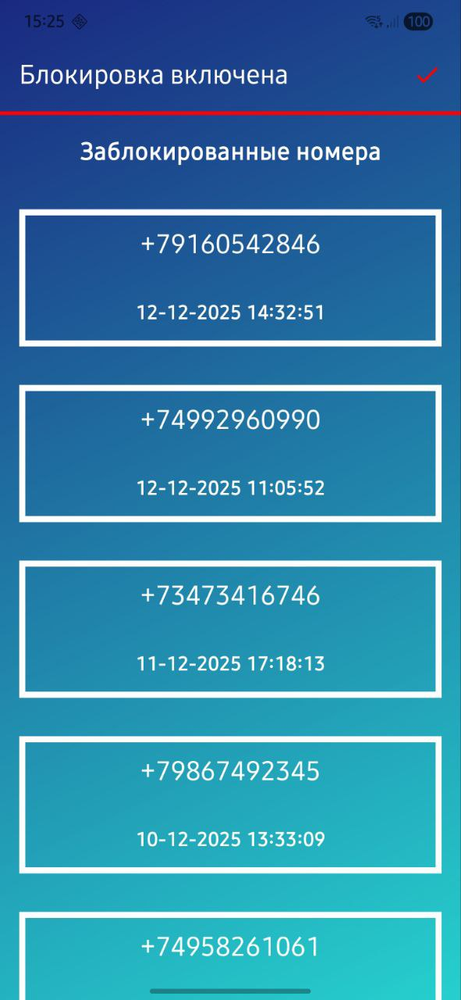

Приложение блокирует входящие вызовы, если номер отсутствует в записной книжке и отправляет уведомление.

Не требует подключения к интернету. 

Хранит список заблокированных вызовов. 

Позволяет временно отключить блокировку в один клик. 

